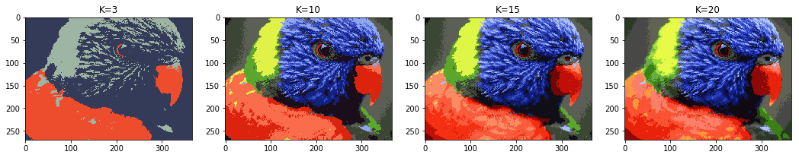

# Expectation Maximization - Gaussian Mixture Model & K-mean Clustering

## Overview
This is a pet project where I trained a mixture of Gaussians (Gaussian Mixture Model) to represent an image and segment it according to the simplified representation. The model is trained with expectation-maximization.

**Note:** To have a better understanding of the algorithms, only NumPy package is used, nothing from scikit-learn is called. It's also a good **vectoration experiement** since the project requires huge volume of data manipulcation/calculation, multi-layer matrix manipulation (k x m x n) is impletmented.

In details, the project consists of following steps: 
1. [Warm-up] Implement k-means clustering to segment a color image.
2. Construct a Gaussian mixture model to be trained with expectation-maximization.
3. Improve the performance of Gaussian mixture model by 1) Use K-means algo to fasten the initialization step; 2) Try other convergence condition.

**Result Preview**: 

Image segamentation with K-mean Clustering (results with different K is shown below):

